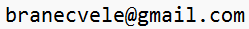

# Take Home task from Wargaming

This is the solution I submit for the **Take Home task** for application to *Automation QA Engineer* position at Wargaming - World of Warships.

The code is written completely in Python, and all of it can be found in the `solution/` directory.

### Code organization and structure

The `solution/` directory contains several modules:
- `task_1_create_db.py` module is the solution for the first task - it contains all of the necessary methods and functions required to create a database that matches the provided schema;
- `task_2_populate_db.py` module is the solution for the second task - it also contains all the necessary methods and functions required to populate the database according to the provided specification;
- `conftest.py` module contains the session-scoped fixture required for the third task, but also contains the `pytest_generate_tests` function needed to generate tests;
- `test_data_consistency.py` contains test definitions that use functionalities of *pytest* tool.

Inside of the `solution/` directory, there is a `solution/utils/` subdirectory. It is home to some modules (*utils*) that group similar-purposed functionalities and constants which are used across several other modules, or which are better off in their separate module. Those utils are:
- `constants.py`, which is a basic python file that contains only constants defined in the task and that can be tweaked in order to produce different code behaviour;
- `db_utils.py`, which contains some general functions which work with the database (note that not all DB-related functions are stored here);
- `random_utils.py`, which contains functions that are connected to operations which utilize randomness;
- `diff_utils.py`, which is home to functions that are used in `test_data_consistency.py` module, but are refactored outside of it for the sake of code readability.

Variable and function naming in these modules is such that it promotes readability and reflects usage - it is written so that the reader may conclude what the variable or a function is used for without having to think much about it. However, on some sections that might not be clear enough, comments are also provided. Blank lines are put in such a manner to promote logical steps. Furthermore, functions that are contained in *utils* each have their docstrings.

During writing of the code, *PEP8* standard was followed as much as possible, and lines' length is limited to maximum of **79** characters.

### How to run the code

This guide assumes that you have proper setup already installed:
- Python - version at least **8**;
- *pytest* tool.

In order to run the code properly:
1. position yourself at `ROOT` or `solution/` directory;
2. run `task_1_create_db.py` script;
3. run `task_2_populate_db.py` script;
4. run `pytest` command.

The output of the `pytest` command should be **600** tests. Without tampering with the constants defined in `constants.py` module, **30** test should pass and **570** should fail on average.

## Information

- Name: Branko Cvetković
- E-mail: 
- Repository purpose: application for the *Automation QA Engineer* position at Wargaming
